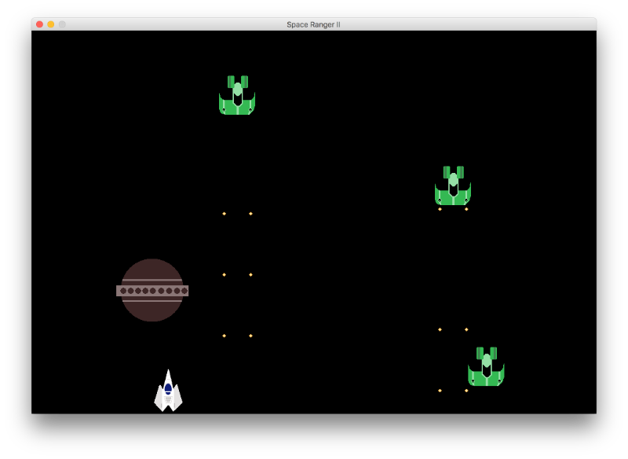

# Space Ranger II



## About

This is a vertical scrolling shooter game with a space theme. You can find an earlier interation of this game here [space-ranger](https://github.com/mes32/space-ranger), a mechanically similar game implemented in Python.

## Requirements

- [Gradle](https://gradle.org) - version 4.5.1
- [Java](https://www.oracle.com) - Java SE 9 Development Kit (JDK)

## Getting started
```bash
# Clone this repository
git clone https://github.com/mes32/space-ranger-2.git

# Change directory to the main project folder
cd space-ranger-2/

# Build the jarfile with Gradle
gradle build

# Launch with Java 9
java -jar build/libs/space-ranger-2.jar
```

## Gameplay
- Use arrow keys to move around
- Hold **`space`** to shoot

## License

The source code in this repository is released under the MIT License.